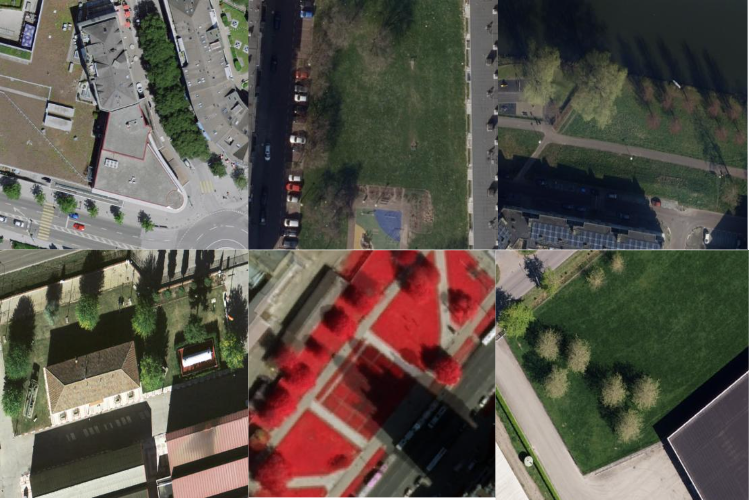

# Tree Counting with Computer Vision

This project focuses on developing deep learning models to accurately count trees in satellite imagery, employing state-of-the-art object detection methods.

## Deep Learning Models:
- **SSD (Single-shot Detector)**: A pioneering single-stage object detection model.
- **RetinaNet**: Utilises novel Focal Loss to handle class imbalance effectively.
- **YOLOv8**: A fast and accurate object detection model optimised for real-time detection.

## Datasets:
1. **Roboflow Dataset**: Contains 489 aerial images featuring trees in urban and suburban areas, collated from the Roboflow platform.
    <!-- Add image link here -->
   
2. **Geospatial Dataset**: Consists of 70 manually annotated satellite images exported from Google Earth Engine, covering various regions and challenging conditions like shadows, seasonal changes, and overlapping canopies.
   

## Experiments:
1. **Model Selection**: Evaluated SSD, RetinaNet, and YOLOv8 to identify the most effective model for tree detection.
   
2. **YOLOv8 Architecture Modifications**: Enhanced YOLOv8 by simplifying its architecture, improving both speed and accuracy.

3. **Generalisation on Geospatial Dataset**: Tested the models on the Geospatial Dataset to assess performance on real-world satellite imagery.

## Directory Structure:
- `Data/`: Datasets used for training and testing.
- `Models/`: Model architecture and training scripts.
- `Notebooks/`: Jupyter notebooks for data exploration, preprocessing, and model training.
- `src/`: Python modules containing reusable functions for model evaluation and data processing.

## Report:
- See full project report 'Final Thesis 23083161.pdf'to read all the implementation details and the findings of the study.

## Setup:

1. **Clone the repository**:
   ```bash
   git clone https://github.com/OsmanHFA/Tree-Detection-on-Satellite-Imagery-Using-YOLO.git
2. **Install the requirements**:
   ```bash
   pip install -r requirements.txt
